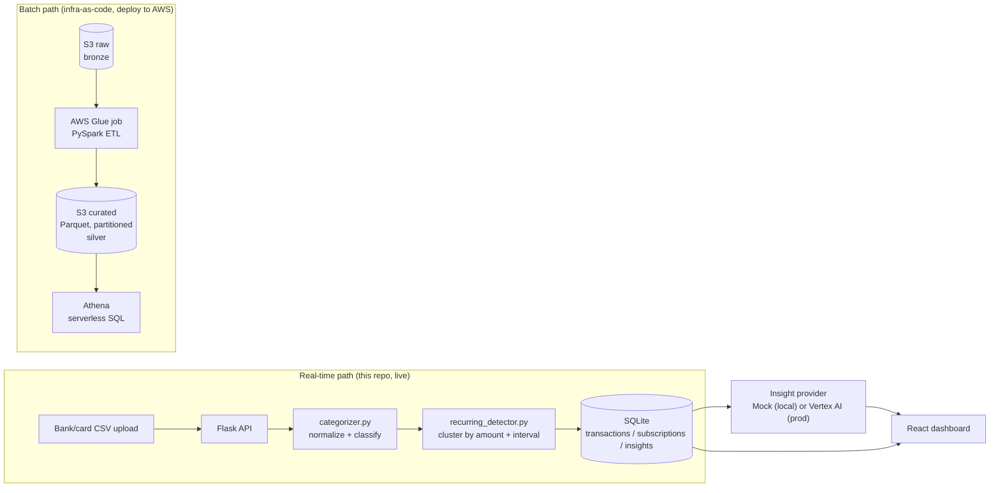

# Architecture

## System overview

SubSense has two ingestion paths into the same data model: a synchronous
per-upload path for the live app, and a batch path for processing years of
history at warehouse scale. Both normalize through the same merchant
categorization rules (kept in sync deliberately, not by accident — see the
note in `etl/README.md`).

## Why two ingestion paths

A single-user auditing their own card statement is a synchronous, small
request — upload a CSV, get a response in under a second. Processing years
of transaction history across many linked accounts (the kind of volume a
real subscription-audit product deals with) is a batch job that shouldn't
run inside an HTTP request/response cycle. The Flask API handles the first
case; the Glue job handles the second. Both normalize through equivalent
categorization logic so a transaction looks the same whether it arrived via
upload or via batch backfill.

## Detection algorithm

`backend/app/detection/recurring_detector.py` is deliberately rule-based
rather than ML-based:

1. Group same-merchant transactions.
2. Cluster by amount (6% tolerance — covers tax/fee variance, not different
   subscription tiers).
3. For each cluster, compute the day-gaps between consecutive charges.
4. Classify a cadence (weekly/monthly/quarterly/annual) only if **both** the
   average gap and the spread of individual gaps fit a band — average alone
   isn't enough (`[5, 55, 30]` days averages to a plausible 30, but isn't
   remotely consistent billing).
5. Score a confidence (0–1) from timing consistency + occurrence count, and
   reject anything below 0.5.

This was tightened twice during development after the seed demo data
surfaced real false positives — see the git log for the specifics. The
rule-based approach was a deliberate choice over an ML classifier: with this
few labeled examples, hand-written thresholds are more precise and,
critically, *explainable* — a user auditing their own money should be able
to see why something got flagged, not just trust a black box.

## Provider abstraction

`backend/app/insights/provider.py` defines an `InsightProvider` interface.
Two implementations exist:

- **`MockProvider`** — deterministic, rule-based, zero network calls. This is
  what actually powers the local demo, because the environment this project
  was built in has no outbound network access.
- **`VertexAIProvider`** — calls Gemini with a structured-JSON prompt,
  written and reviewed against the real `vertexai` SDK but not live-tested
  (same network constraint).

Swapping between them is one environment variable (`INSIGHT_PROVIDER`) — no
code in the routers, services, or frontend needs to know which is active.

## Data model

Three tables, hand-written SQL (`backend/app/schema.sql`), no ORM:

- **`transactions`** — every ingested row, normalized + categorized.
- **`subscriptions`** — detected recurring charges, one row per merchant+amount
  cluster, upserted (not duplicated) as new transactions arrive.
- **`insights`** — AI/rule-generated observations, linked back to a
  subscription where relevant.

See `backend/README.md` for why this is raw SQL instead of an ORM.

## What's verified vs. what's reviewed

Being direct about this because it matters for anyone extending this project:

| Layer | Status |
|---|---|
| Categorization + recurring detection (`app/ingestion/`, `app/detection/`) | **Fully unit-tested.** 38 tests, including regression tests for two real false-positive bugs found during development. |
| Orchestration (`app/services.py`) | **Fully tested**, including against an in-memory SQLite DB. |
| Flask API layer | **Boot-tested live** — server started, every endpoint hit with real HTTP requests, including file upload. |
| Frontend → API contract | **Verified live** — every request shape the React components make was tested against the running Flask server before the components were written. |
| React components | **Syntax-checked, not build-tested.** No bundler (Vite) was available in the build sandbox. Written carefully against a verified API contract; run `npm install && npm run dev` to actually see it render. |
| AWS Glue job | **Written and cross-validated** — its categorization logic was diff-tested against the proven backend version (zero drift across 9 test cases) — but not run against a live Glue environment. |
| Athena queries | Written against the Glue job's known output schema, not run against live Athena. |

Nothing here is hidden or glossed over. If you extend this project, the
frontend and the AWS layer are where to look first before trusting new
behavior.
